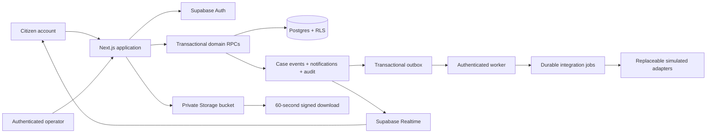

# Architecture

## Runtime boundaries

`lib/repository.ts` is the application persistence boundary. `NCRP_BACKEND=supabase` selects the production repository; missing Supabase configuration in development selects the local demo adapter. `lib/db.ts` refuses to open SQLite whenever the backend is explicitly Supabase, preventing a production `/tmp` fallback.

Supabase migrations own the production schema. `create_case`, `execute_case_command` and `record_evidence_upload` are transactional database commands. The operator command locks the case row, compares `cases.version`, performs a validated mutation, reconciles movement totals, appends a case event and citizen notification, adds a hash-chained audit record and stores an idempotency receipt in one transaction. A retry with the same key returns the receipt; a stale version returns `CASE_CHANGED`.

## Identity and authorization

Supabase Auth owns account identity and refresh tokens. The auth trigger creates every new account as a citizen. Operator promotion requires the server-only service credential through `scripts/provision-operator.ts`; authenticated clients have permission to update only their own `display_name`.

RLS is the primary data boundary. Citizens can select only resources linked to their own `citizens.user_id`; operators receive the read surface required for the operations queue and audit history. Route handlers also verify roles and ownership as defense in depth. The service key is confined to the worker, seed and rollback-cleanup paths.

## Evidence and realtime

Evidence objects use the private `case-evidence` bucket and keys shaped as `<auth-user>/<case-uuid>/<random-uuid>-<safe-name>`. Storage RLS enforces the first two path segments. The application validates size, MIME and signature, hashes bytes before upload, never overwrites, and records retention/soft-delete/legal-hold metadata. Reads are temporary signed redirects.

Citizen clients subscribe to Postgres changes for their authorized case events. Every view reloads canonical persisted state after a notification, so Realtime is only an invalidation signal—never the source of truth. The local demo retains SSE solely as an adapter for offline judging.

## Durable work

External requests are inserted into `integration_jobs` in the same transaction as the initiating command. Workers claim rows using `FOR UPDATE SKIP LOCKED`, pass work to adapter contracts, record external references and retry with bounded exponential backoff. Expired leases are recovered automatically. Case events also create `outbox_events`; the worker verifies the persisted source before marking publication complete. Supabase Realtime distributes committed database events across application instances.
