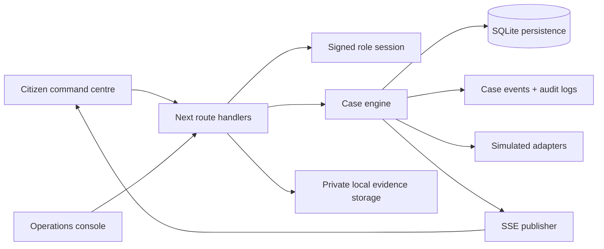

# Architecture

## Domain and event model

The database has `users`, `citizens`, `cases`, `incidents`, `transactions`, `fund_movements`, `institutions`, `evidence`, `evidence_requests`, `agency_assignments`, `fir_records`, `case_events`, `notifications` and `audit_logs`. The schema is initialized in `lib/db.ts` and can be inspected directly with a SQLite client.

Operator actions are domain commands—not freeform status edits. The case engine validates state transitions and command preconditions before atomically updating entities, appending a case event, writing an internal audit record and citizen notification, then publishing a case update. The citizen timeline is rendered solely from `case_events`; the money trail is rendered from `fund_movements`.

The institutional-response SLA is calculated from the persisted `FREEZE_REQUEST_CREATED` timestamp and a two-hour threshold. A response event satisfies it; an overdue evaluation atomically appends `SLA_BREACHED` and `CASE_ESCALATED` once, changes ownership to the escalation desk, notifies the citizen and publishes the update.

## Security and realtime

The server verifies the role from a signed, HTTP-only, same-site cookie before protected routes and mutations. Inputs are validated with Zod; uploads have MIME and size limits and are stored outside public static assets with a SHA-256 fingerprint. SSE distributes updates from server domain commands; it contains no client-side simulation timer.

SQLite is intentionally self-contained for this local vertical slice. A production deployment should use PostgreSQL, private object storage, a durable pub/sub/realtime provider, and row-level authorization.
